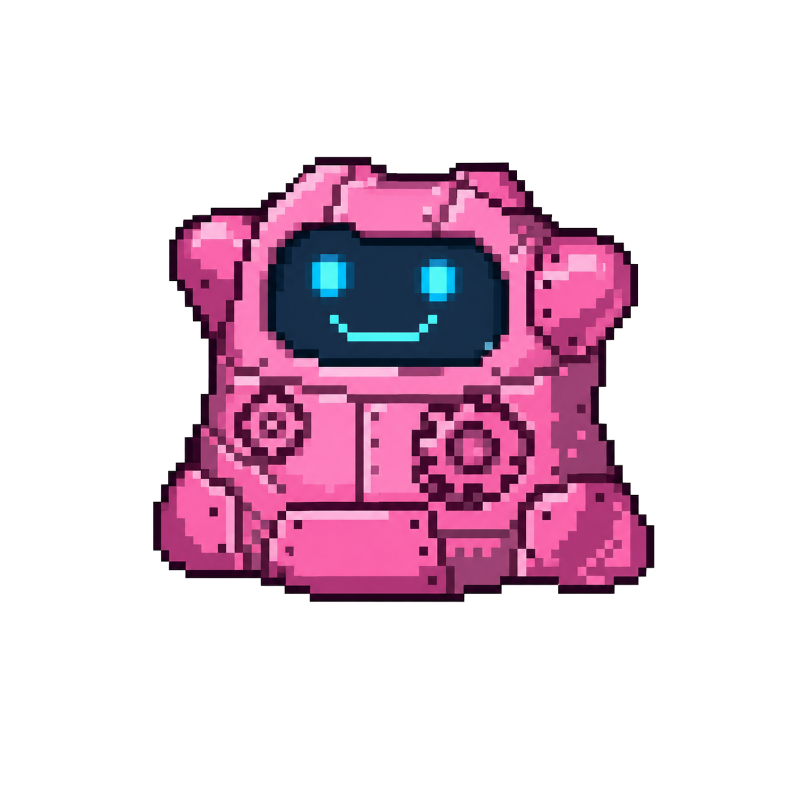
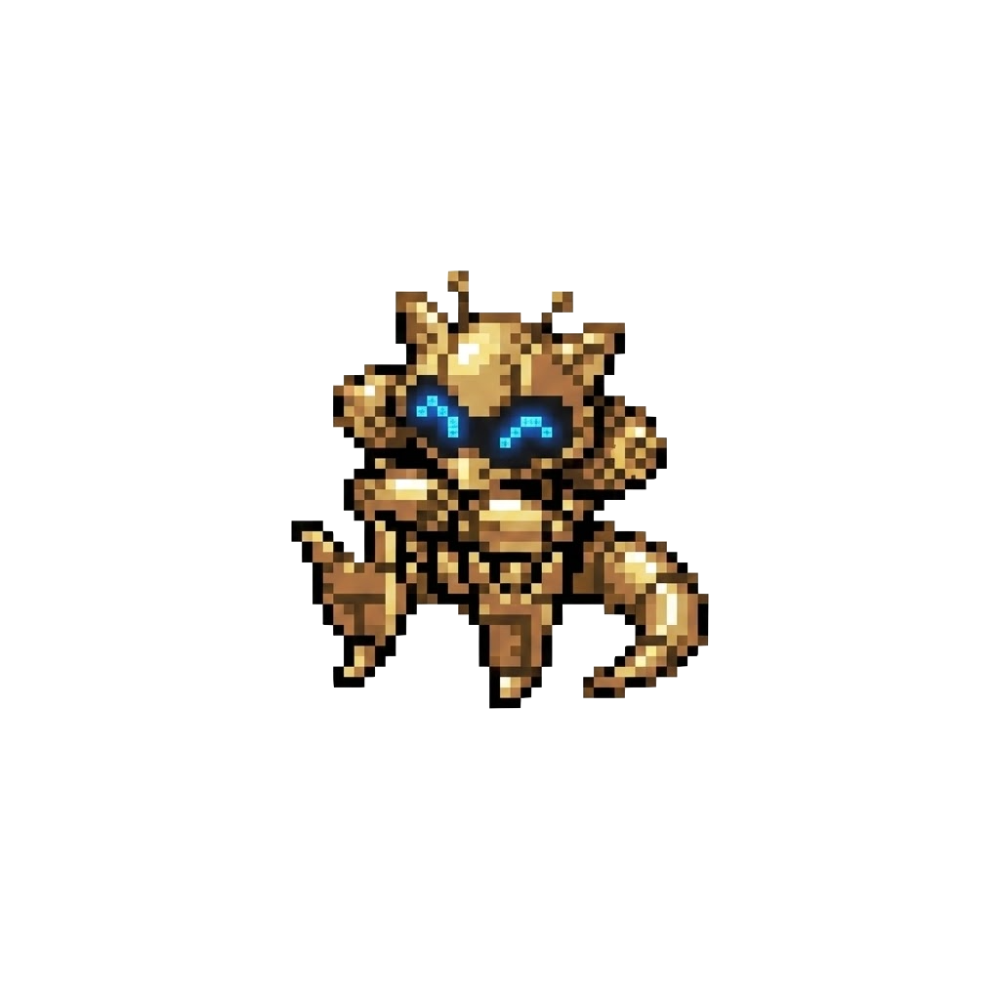
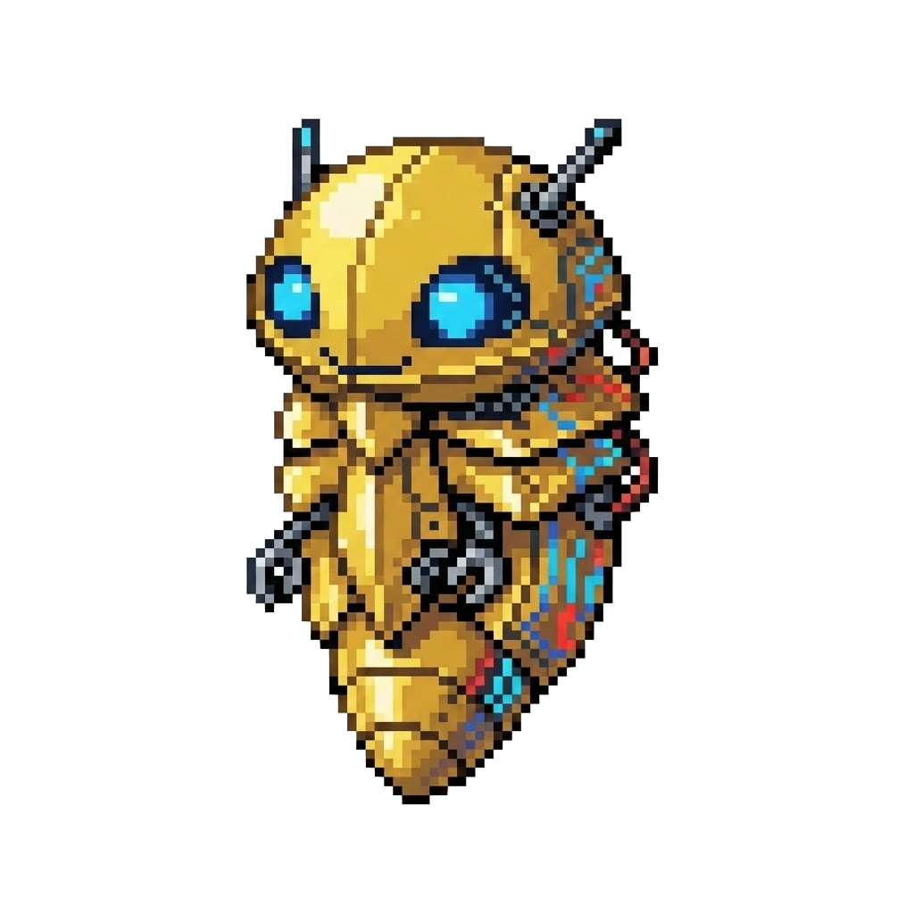
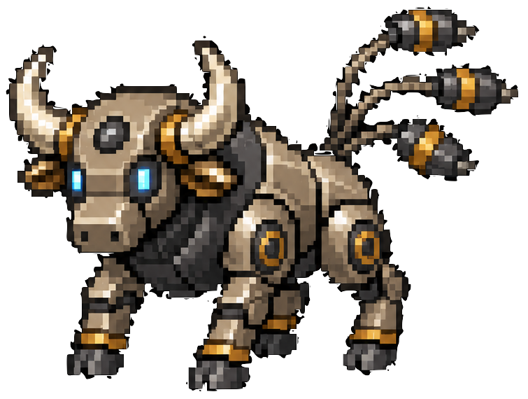

<div align="center">
    
    <br>
    
</div>

<div align="center">

[](https://arxiv.org/abs/2504.04395)
[](https://metamon.tech)
[](https://discord.gg/9zuJqgpDGg)

</div>


<br>

**Metamon** enables plug-and-play reinforcement learning (RL) research on  [Pokémon Showdown](https://pokemonshowdown.com/) by providing:
 
1) Datasets of 5M+ trajectories "reconstructed" from real human battles and 20M+ generated by self-play between agents.
2) Starting points for training (or finetuning) your own imitation learning (IL) and RL policies.
3) Standardized sets of competitive teams for diverse training and evaluation.
4) 40+ baseline policies ranging from beginner to expert-level human play. 

Metamon began as a conference paper, [“Human-Level Competitive Pokémon via Scalable Offline RL and Transformers”](https://arxiv.org/abs/2504.04395), at RLC 2025. It later served as both a starter kit and winning baseline for the [NeurIPS 2025 PokéAgent Challenge](https://arxiv.org/abs/2603.15563), and now provides RL baselines for the [PokéAgent Leaderboard](https://battling.pokeagentchallenge.com). Although Metamon is primarily intended to make Pokémon an accessible, data-rich research domain, our agents have consistently been among the strongest Pokémon singles bots, with **ratings against human players now reaching the 90-99th percentile** depending on the ruleset, and may be useful to competitive players as a practice opponent or analysis tool. 

<br>

<div align="center">
    
</div>

<br>

#### Supported Rulesets

Pokémon Showdown hosts many different rulesets spanning nine generations of the video game franchise. Metamon initially focused on the most popular singles ruleset ("OverUsed") for **Generations 1, 2, 3, and 4** but has recently expanded to include **Generation 9 OverUsed** (OU).

<br>


### Table of Contents

1. [**Installation**](#installation)
2. [**Quick Start**](#quick-start)
3. [**Pretrained Models**](#pretrained-models)
4. [**Battle Datasets**](#battle-datasets)
5. [**Team Sets**](#team-sets)
6. [**Baselines**](#baselines)
7. [**Observation Spaces, Action Spaces, & Reward Functions**](#observation-spaces-action-spaces--reward-functions)
8. [**Training and Evaluation**](#training-and-evaluation)
9. [**Other Datasets**](#other-datasets)
10. [**Battle Backends**](#battle-backends)
11. [**Experimental Features**](#experimental-features)
12. [**Acknowledgements**](#acknowledgements)
13. [**Citation**](#citation)


<br>
 
---

<br>

<details>
<summary><h2>Installation</h2></summary>

Metamon is written and tested for linux and python 3.10+. We recommend creating a fresh virtual environment or [conda](https://docs.anaconda.com/anaconda/install/) environment:

```shell
conda create -n metamon python==3.10
conda activate metamon
```

Then, install with:

```shell
git clone --recursive git@github.com:UT-Austin-RPL/metamon.git
cd metamon
pip install -e .
```

To install [Pokémon Showdown](https://pokemonshowdown.com/), we'll need a modern version of `npm` / Node.js (instructions [here](https://nodejs.org/en/download/package-manager)). Note that Showdown undergoes constant updates... breaking changes are rare, but do happen. The version that downloads with this repo (`metamon/server`) is always supported.

```shell
cd server/pokemon-showdown
npm install
```

We will need to have the Showdown server running in the background while using Metamon:
```shell
# in the background (`screen`, etc.)
node pokemon-showdown start --no-security
# no-security removes battle speed throttling and password requirements on your local server
```

If necessary, we can customize the server settings (`config/config.js`) or [the rules for each game mode](https://github.com/smogon/pokemon-showdown/blob/master/config/CUSTOM-RULES.md).

Verify that installation has gone smoothly with:
```bash
# run a few test battles on the local server
python -m metamon.env
```

Metamon provides large datasets of Pokémon team files, human battles, and other statistics that will automatically download when requested. Specify a path with:
```bash
# add to ~/.bashrc
export METAMON_CACHE_DIR=/path/to/plenty/of/disk/space
```

</details>

<br>

____

<br>

## Quick Start

Metamon makes it easy to turn Pokémon into an RL research problem. Pick a set of Pokémon teams to play with, an observation space, an action space, and a reward function:

```python
from metamon.env import get_metamon_teams
from metamon.interface import DefaultObservationSpace, DefaultShapedReward, DefaultActionSpace

team_set = get_metamon_teams("gen1ou", "competitive")
obs_space = DefaultObservationSpace()
reward_fn = DefaultShapedReward()
action_space = DefaultActionSpace()
```

Then, battle against built-in baselines (or any [`poke_env.Player`](https://github.com/hsahovic/poke-env)):

```python 
from metamon.env import BattleAgainstBaseline
from metamon.baselines import get_baseline

env = BattleAgainstBaseline(
    battle_format="gen1ou",
    observation_space=obs_space,
    action_space=action_space,
    reward_function=reward_fn,
    team_set=team_set,
    opponent_type=get_baseline("Gen1BossAI"),
)

# standard `gymnasium` environment
obs, info = env.reset()
next_obs, reward, terminated, truncated, info = env.step(env.action_space.sample())
```

The more flexible option is to request battles on our local Showdown server and battle anyone else who is online (humans, pretrained agents, or other Pokémon AI projects). If it plays Showdown, we can battle against it!

```python
from metamon.env import QueueOnLocalLadder

env = QueueOnLocalLadder(
    battle_format="gen1ou",
    player_username="my_scary_username",
    num_battles=10,
    observation_space=obs_space,
    action_space=action_space,
    reward_function=reward_fn,
    player_team_set=team_set,
)
```

Metamon's main feature is that it creates a dataset of "reconstructed" human demonstrations for these environments:

```python
from metamon.data import ParsedReplayDataset

human_dset = ParsedReplayDataset(
    observation_space=obs_space,
    action_space=action_space,
    reward_function=reward_fn,
    formats=["gen1ou"],
)
obs_seq, action_seq, reward_seq, done_seq = human_dset[0]
```

We can also load a starting dataset of self-play trajectories generated by the metamon project:

```python
from metamon.data import SelfPlayDataset

selfplay_dset = SelfPlayDataset(
    observation_space=obs_space,
    action_space=action_space,
    reward_function=reward_fn,
    formats=["gen1ou"],
    subset="pac-base",  # or "pac-exploratory" or "pac-tauros"
)
```

We can save our own agents' experience in the same format:

```python
from metamon.data import MetamonDataset

env = QueueOnLocalLadder(
    .., # rest of args
    save_trajectories_to="my_data_path",
)
online_dset = MetamonDataset(
    dset_root="my_data_path",
    formats=["gen9ou"],  # match your env format
    observation_space=obs_space,
    action_space=action_space,
    reward_function=reward_fn,
)
terminated = False
while not terminated:
    *_, terminated, _, _ = env.step(env.action_space.sample())

# find completed battles before loading examples
online_dset.refresh_files()
```

You are free to use this data to train an agent however you'd like, but we provide starting points for smaller-scale IL (`python -m metamon.il.train`) and RL (`python -m metamon.rl.train`), and a large set of pretrained models from our paper.

<br>

____

<br>


## Pretrained Models

We have made every checkpoint of 40+ models available on huggingface at [`jakegrigsby/metamon`](https://huggingface.co/jakegrigsby/metamon/tree/main). You will need to install [`amago`](https://github.com/UT-Austin-RPL/amago), which is an RL codebase by the same authors. Follow instructions [here](https://ut-austin-rpl.github.io/amago/installation.html).


<div align="center">
    
</div>

<br>

Load and run pretrained models with `metamon.rl.evaluate`. See the full [Evaluation README](metamon/rl/evaluate/README.md) for all eval types (heuristic baselines, local ladder, head-to-head challenges, parameter sweeps, and more). Quick example:

```bash
python -m metamon.rl.evaluate --eval_type heuristic --agent Kakuna --gens 1 --formats ou --total_battles 100
```

<br>


### Featured Policies

Most Metamon policies were stepping stones to later (better) versions, and are now mainly useful as baselines or extra opponents in self-play data collection. Some notable exceptions worth knowing about are:

<table>
<tr>
  <th align="center">Model</th><th align="center">Size</th><th align="center">Date</th><th align="center">Description</th>
  <th colspan="5" align="center">Ladder Ratings with Sample Teams (GXE)</th>
</tr>
<tr>
  <th align="center"></th><th align="center"></th><th align="center"></th><th align="center"></th>
  <th align="center">G1</th><th align="center">G2</th><th align="center">G3</th><th align="center">G4</th><th align="center">G9</th>
</tr>
<tr>
  <td align="center"><br><b>SyntheticRLV2</b></td>
  <td align="center">200M</td>
  <td align="center">Sep 2024</td>
  <td>Original paper's best policy. Remains the basis of several successful third-party efforts to specialize in Gen1. <b>Most previous models have complete human ratings (see  below)</b>, but we have become a lot more cautious about laddering.</td>
  <td align="center">77%</td><td align="center">68%</td><td align="center">64%</td><td align="center">66%</td><td align="center">–</td>
</tr>
<tr>
  <td align="center"><br><b>Abra</b></td>
  <td align="center">57M</td>
  <td align="center">Jul 2025</td>
  <td>The best <i>gen9ou</i> agent that was open-sourced during the , and therefore the basis of many of the best third-party metamon extensions.</td>
  <td align="center">–</td><td align="center">–</td><td align="center">–</td><td align="center">–</td><td align="center">50%</td>
</tr>
<tr>
  <td align="center"><br><b>Kadabra3</b></td>
  <td align="center">57M</td>
  <td align="center">Sep 2025</td>
  <td>The best policy trained in time to participate in the  (as an organizer baseline). #1 in the Gen1OU qualifier and #2 in Gen9OU behind <a href="https://github.com/pmariglia/foul-play">foul-play</a>.</td>
  <td align="center">80%</td><td align="center">–</td><td align="center">–</td><td align="center">–</td><td align="center">64%</td>
</tr>
<tr>
  <td align="center"><br><b>Kakuna</b></td>
  <td align="center">142M</td>
  <td align="center">Dec 2025</td>
  <td><b>The best public metamon model</b> – leading by nearly every metric. Trained on diverse teams to serve as a strong foundation for further research in any gen. Appears on all 5 OU leaderboards and is consistently 1500+ Elo in Gen1OU.</td>
  <td align="center">82%</td><td align="center">70%</td><td align="center">63%</td><td align="center">64%</td><td align="center">71%</td>
</tr>
<tr>
  <td align="center"><br><b>TaurosV0</b></td>
  <td align="center">62M</td>
  <td align="center">May 2026</td>
  <td>Gen1OU specialist. <code>TaurosEnsemble</code> has held <b>#1 on the human Showdown ladder</b> (following <code>KakunaEnsemble</code>, the first Metamon agent to do so).</td>
  <td align="center">83%</td><td align="center">–</td><td align="center">–</td><td align="center">–</td><td align="center">–</td>
</tr>
</table>


Models can be loosely divided into three eras of active development:

1. **RLC Paper**: Trained on Gen 1-4 with old versions of the replay dataset and team sets.
2. **NeurIPS PokéAgent Challenge**: Developed new baselines by *reducing* model sizes, reward shaping, and the paper's emphasis on long-term memory while *improving* generalization over diverse team choices and prioritizing support for gen9ou. However, it took several iterations to recover the paper's Gen 1-4 performance.
3. **Post-PokéAgent**: Metamon continues to improve, though as a hobby project for the original team with sporadic development and maintenance. Our focus has shifted away from serving as a "starter kit" and toward chasing expert-level human performance.

<br>

<details>
<summary><h3>Paper Policies</h3></summary>

*Paper policies play Gens 1-4 and are discussed in detail in the RLC 2025 paper. Some model sizes have several variants testing different RL objectives. See `metamon/rl/pretrained.py` for a complete list.*

<table>
  <tr>
    <th width="70" align="center"></th>
    <th align="center">Model Name (<code>--agent</code>)</th>
    <th align="center">Description</th>
  </tr>
  <tr><td></td><td><strong><code>SmallIL</code></strong> (2 variants)</td><td>15M imitation learning model trained on 1M human battles</td></tr>
  <tr><td></td><td><strong><code>SmallRL</code></strong> (5 variants)</td><td>15M actor-critic model trained on 1M human battles</td></tr>
  <tr><td></td><td><strong><code>MediumIL</code></strong></td><td>50M imitation learning model trained on 1M human battles</td></tr>
  <tr><td></td><td><strong><code>MediumRL</code></strong> (3 variants)</td><td>50M actor-critic model trained on 1M human battles</td></tr>
  <tr><td></td><td><strong><code>LargeIL</code></strong></td><td>200M imitation learning model trained on 1M human battles</td></tr>
  <tr><td></td><td><strong><code>LargeRL</code></strong></td><td>200M actor-critic model trained on 1M human battles</td></tr>
  <tr><td></td><td><strong><code>SyntheticRLV0</code></strong></td><td>200M actor-critic model trained on 1M human + 1M diverse self-play battles</td></tr>
  <tr><td></td><td><strong><code>SyntheticRLV1</code></strong></td><td>200M actor-critic model trained on 1M human + 2M diverse self-play battles</td></tr>
  <tr><td></td><td><strong><code>SyntheticRLV1_SelfPlay</code></strong></td><td>SyntheticRLV1 fine-tuned on 2M extra battles against itself</td></tr>
  <tr><td></td><td><strong><code>SyntheticRLV1_PlusPlus</code></strong></td><td>SyntheticRLV1 finetuned on 2M extra battles against diverse opponents</td></tr>
  <tr><td align="center"></td><td><strong><code>SyntheticRLV2</code></strong></td><td>Final 200M actor-critic model with value classification trained on 1M human + 4M diverse self-play battles.</td></tr>
</table>

Here is a reference of human evals for key models according to our paper:

<div align="center">
    
</div>

</details>

<br>

<details>
<summary><h3>PokéAgent Challenge Policies</h3></summary>

*Policies trained during the PokéAgent Challenge play Gens 1-4 **and 9**, but have a clear bias towards Gen 1 OU and Gen 9 OU. Their docstrings in `metamon/rl/pretrained.py` have some extra discussion and eval metrics.*

<table>
  <tr>
    <th width="70" align="center"></th>
    <th align="center">Model Name (<code>--agent</code>)</th>
    <th align="center">Description</th>
  </tr>
  <tr><td></td><td><strong><code>SmallRLGen9Beta</code></strong></td><td>Prototype 15M actor-critic model trained <em>after</em> the dataset was expanded to include Gen9OU</td></tr>
  <tr><td align="center"></td><td><strong><code>Abra</code></strong></td><td>57M actor-critic trained on <code>parsed-replays v3</code> and a small set of synthetic battles. First of a new series of Gen9OU-compatible policies trained in a similar style to the paper's "Synthetic" agents.</td></tr>
  <tr><td align="center"></td><td><strong><code>Kadabra, Kadabra2, Kadabra3, Kadabra4</code></strong></td><td>Are further extensions of Abra to larger datasets of self-play battles (> 11M) trained and deployed as organizer baselines throughout the PokéAgent Challenge practice ladder.</td></tr>
  <tr><td align="center"></td><td><strong><code>Alakazam</code></strong></td><td>Considered the final edition of the main PokéAgent Challenge effort. Patches a bug that impacted tera type visibility. Actually slightly worse than Kadabra3/4 with competitive teams, but is more robust to diverse team choices thanks to a larger dataset.</td></tr>
  <tr><td align="center"></td><td><strong><code>Minikazam</code></strong></td><td>4.7M RNN trained on <code>parsed-replays v4</code> and a large dataset of self-play battles. Tries to compensate for low parameter count by training on <code>Alakazam</code>'s dataset. Creates a decent starting point for finetuning on any GPU. <a href="https://docs.google.com/spreadsheets/d/1GU7-Jh0MkIKWhiS1WNQiPfv49WIajanUF4MjKeghMAc/edit?usp=sharing">Evals here</a>.</td></tr>
  <tr><td></td><td><strong><code>Superkazam</code></strong></td><td>An attempt to revisit Alakazam's (11M self-play + 4M human replay) dataset at a model size closer to the original paper (142M). <a href="https://docs.google.com/spreadsheets/d/1lU8tQ0tnnupY28kIyK6FVtvPmxLSVT9_slLShOhRsqg/edit?usp=sharing">Evals here</a>.</td></tr>
  <tr><td align="center"></td><td><strong><code>Kakuna</code></strong></td><td><strong>The best public metamon agent.</strong> Superkazam finetuned on 7M additional self-play battles collected at higher sampling temperature for improved exploration and value estimation. Reduced sampling weight of human replays to prioritize high-Elo self-play data. Compensates for our inattention to Gens2-4 during the PokéAgent Challenge. <a href="https://docs.google.com/spreadsheets/d/1lU8tQ0tnnupY28kIyK6FVtvPmxLSVT9_slLShOhRsqg/edit?usp=sharing">Evals here</a>.</td></tr>
</table>

</details>

<br>

<details>
<summary><h3>Post-PokéAgent Policies</h3></summary>

*Policies trained after the conclusion of the PokéAgent Challenge. Metamon releases now chase expert-human performance; models may be specialists in a particular ruleset or trained on unreleased datasets.*

<table>
  <tr>
    <th width="70" align="center"></th>
    <th align="center">Model Name (<code>--agent</code>)</th>
    <th align="center">Description</th>
  </tr>
  <tr><td></td><td><strong><code>V2A*</code></strong></td><td>Many small-scale (~12–15M param) RL hyperparameter ablations (<code>V2A</code>, <code>V2ASeed2</code>, <code>V2ABeta01</code>, <code>V2AGroupedV2ISFilter</code>, etc.) on Gen1OU. Performance is broadly similar—between <code>SyntheticRLV2</code> and <code>Kakuna</code>—and they are mainly useful for boosting self-play diversity rather than as standalone ladder agents.</td></tr>
  <tr><td align="center"></td><td><strong><code>TaurosV0</code></strong></td><td>Scales up the V2A findings on a fresh Gen1OU dataset at 50M params. The best standalone Gen1OU policy in metamon to date. <code>TaurosEnsemble</code> also reached <strong>#1 on the human Showdown ladder</strong>, building on the earlier <code>KakunaEnsemble</code> milestone.</td></tr>
</table>

</details>

<br>

### Internal Leaderboards


Human ratings above are the best way to anchor performance to an external metric, but we primarily rely on self comparisons across generations and [team sets](#team-sets) to guide new research. We can get a general sense of the ***relative* strength** of metamon over time by turning policies loose on a locally hosted Showdown ladder and sampling from the same `TeamSet`. The [PokéAgent Server](https://battling.pokeagentchallenge.com) also serves as a live leaderboard, though team sets are inconsistent.

* = PokéAgent Challenge policy,  = Paper policy.*


> [!TIP]
> *These GXE values are a measure of performance *relative* to the listed models and **have no connection to ratings on the public ladder**. `TaurosV0` is the best Gen1OU policy, but does not play other rulesets.*

<table>
<tr><th colspan="11" align="center"><strong>Early Gen OU Local GXE</strong></th></tr>
<tr>
  <th align="center"></th>
  <th align="center">Model</th>
  <th colspan="4" align="center">Competitive TeamSet</th>
  <th colspan="4" align="center">Modern Replays TeamSet</th>
  <th align="center">Avg Rank</th>
</tr>
<tr>
  <th align="center"></th>
  <th align="center"></th>
  <th align="center">G1</th>
  <th align="center">G2</th>
  <th align="center">G3</th>
  <th align="center">G4</th>
  <th align="center">G1</th>
  <th align="center">G2</th>
  <th align="center">G3</th>
  <th align="center">G4</th>
  <th align="center"></th>
</tr>
<tr>
<td align="center"></td>
<td align="center"></td>
<td align="center"><strong>75%</strong></td>
<td align="center"><strong>66%</strong></td>
<td align="center"><strong>63%</strong></td>
<td align="center"><strong>60%</strong></td>
<td align="center"><strong>68%</strong></td>
<td align="center"><strong>71%</strong></td>
<td align="center"><strong>67%</strong></td>
<td align="center"><strong>69%</strong></td>
<td align="center">1.0</td>
</tr>
<tr>
<td align="center"></td>
<td align="center"></td>
<td align="center">67%</td>
<td align="center">63%</td>
<td align="center">59%</td>
<td align="center"><ins>58%</ins></td>
<td align="center">64%</td>
<td align="center">61%</td>
<td align="center">62%</td>
<td align="center">61%</td>
<td align="center">3.0</td>
</tr>
<tr>
<td align="center"></td>
<td align="center"></td>
<td align="center">66%</td>
<td align="center">60%</td>
<td align="center">58%</td>
<td align="center"><ins>58%</ins></td>
<td align="center"><ins>68%</ins></td>
<td align="center">60%</td>
<td align="center"><ins>66%</ins></td>
<td align="center">63%</td>
<td align="center">3.5</td>
</tr>
<tr>
<td align="center"></td>
<td align="center"></td>
<td align="center">68%</td>
<td align="center">61%</td>
<td align="center">57%</td>
<td align="center">57%</td>
<td align="center"><ins>67%</ins></td>
<td align="center">60%</td>
<td align="center">60%</td>
<td align="center">60%</td>
<td align="center">4.0</td>
</tr>
<tr>
<td align="center"></td>
<td align="center"></td>
<td align="center">67%</td>
<td align="center">60%</td>
<td align="center">58%</td>
<td align="center">57%</td>
<td align="center">64%</td>
<td align="center">62%</td>
<td align="center">59%</td>
<td align="center">60%</td>
<td align="center">4.4</td>
</tr>
<tr>
<td align="center"></td>
<td align="center"></td>
<td align="center">66%</td>
<td align="center">59%</td>
<td align="center">56%</td>
<td align="center">57%</td>
<td align="center">64%</td>
<td align="center">58%</td>
<td align="center">61%</td>
<td align="center">58%</td>
<td align="center">5.5</td>
</tr>
<tr>
<td align="center"></td>
<td align="center"></td>
<td align="center">50%</td>
<td align="center">59%</td>
<td align="center">55%</td>
<td align="center">55%</td>
<td align="center">54%</td>
<td align="center">61%</td>
<td align="center">55%</td>
<td align="center">56%</td>
<td align="center">6.9</td>
</tr>
<tr>
<td align="center"></td>
<td align="center"></td>
<td align="center">56%</td>
<td align="center">50%</td>
<td align="center">47%</td>
<td align="center">47%</td>
<td align="center">55%</td>
<td align="center">53%</td>
<td align="center">50%</td>
<td align="center">54%</td>
<td align="center">7.9</td>
</tr>
<tr>
<td align="center"></td>
<td align="center"></td>
<td align="center">43%</td>
<td align="center">47%</td>
<td align="center">41%</td>
<td align="center">45%</td>
<td align="center">47%</td>
<td align="center">49%</td>
<td align="center">48%</td>
<td align="center">48%</td>
<td align="center">10.0</td>
</tr>
<tr>
<td align="center"></td>
<td align="center"></td>
<td align="center">43%</td>
<td align="center">39%</td>
<td align="center">42%</td>
<td align="center">46%</td>
<td align="center">46%</td>
<td align="center">45%</td>
<td align="center">44%</td>
<td align="center">49%</td>
<td align="center">10.2</td>
</tr>
<tr>
<td align="center"></td>
<td align="center"></td>
<td align="center">41%</td>
<td align="center">38%</td>
<td align="center">48%</td>
<td align="center">40%</td>
<td align="center">45%</td>
<td align="center">41%</td>
<td align="center">49%</td>
<td align="center">45%</td>
<td align="center">11.1</td>
</tr>
<tr>
<td align="center"></td>
<td align="center"></td>
<td align="center">39%</td>
<td align="center">44%</td>
<td align="center">44%</td>
<td align="center">45%</td>
<td align="center">40%</td>
<td align="center">45%</td>
<td align="center">48%</td>
<td align="center">48%</td>
<td align="center">11.2</td>
</tr>
<tr>
<td align="center"></td>
<td align="center"></td>
<td align="center">–</td>
<td align="center">–</td>
<td align="center">–</td>
<td align="center">–</td>
<td align="center">44%</td>
<td align="center">42%</td>
<td align="center">45%</td>
<td align="center">48%</td>
<td align="center">12.0</td>
</tr>
<tr>
<td align="center"></td>
<td align="center"></td>
<td align="center">25%</td>
<td align="center">35%</td>
<td align="center">39%</td>
<td align="center">39%</td>
<td align="center">30%</td>
<td align="center">39%</td>
<td align="center">41%</td>
<td align="center">44%</td>
<td align="center">13.9</td>
</tr>
<tr>
<td align="center"></td>
<td align="center"></td>
<td align="center">39%</td>
<td align="center">34%</td>
<td align="center">34%</td>
<td align="center">34%</td>
<td align="center">41%</td>
<td align="center">36%</td>
<td align="center">36%</td>
<td align="center">39%</td>
<td align="center">14.6</td>
</tr>
<tr>
<td align="center"></td>
<td align="center"></td>
<td align="center">24%</td>
<td align="center">36%</td>
<td align="center">39%</td>
<td align="center">35%</td>
<td align="center">28%</td>
<td align="center">35%</td>
<td align="center">38%</td>
<td align="center">41%</td>
<td align="center">14.8</td>
</tr>
</table>

> [!TIP]
>  are (predictably) weak in Gen9OU because they were never trained to play the format and use observation spaces that assume Team Preview is not available. 

<table>
<tr><th colspan="5" align="center"><strong>Gen9OU Local GXE</strong></th></tr>
<tr>
  <th align="center"></th>
  <th align="center">Model</th>
  <th align="center">Competitive TeamSet</th>
  <th align="center">Modern Replays TeamSet</th>
  <th align="center">Avg Rank</th>
</tr>
<tr>
<td align="center"></td>
<td align="center"></td>
<td align="center"><strong>76%</strong></td>
<td align="center"><strong>74%</strong></td>
<td align="center">1.0</td>
</tr>
<tr>
<td align="center"></td>
<td align="center"></td>
<td align="center"><ins>75%</ins></td>
<td align="center"><ins>73%</ins></td>
<td align="center">2.5</td>
</tr>
<tr>
<td align="center"></td>
<td align="center"></td>
<td align="center"><ins>75%</ins></td>
<td align="center"><ins>73%</ins></td>
<td align="center">2.5</td>
</tr>
<tr>
<td align="center"></td>
<td align="center"></td>
<td align="center">73%</td>
<td align="center">71%</td>
<td align="center">4.5</td>
</tr>
<tr>
<td align="center"></td>
<td align="center"></td>
<td align="center">73%</td>
<td align="center">69%</td>
<td align="center">5.0</td>
</tr>
<tr>
<td align="center"></td>
<td align="center"></td>
<td align="center">73%</td>
<td align="center">71%</td>
<td align="center">5.5</td>
</tr>
<tr>
<td align="center"></td>
<td align="center"></td>
<td align="center">61%</td>
<td align="center">57%</td>
<td align="center">7.0</td>
</tr>
<tr>
<td align="center"></td>
<td align="center"></td>
<td align="center">56%</td>
<td align="center">57%</td>
<td align="center">8.5</td>
</tr>
<tr>
<td align="center"></td>
<td align="center"></td>
<td align="center">58%</td>
<td align="center">55%</td>
<td align="center">8.5</td>
</tr>
<tr>
<td align="center"></td>
<td align="center"></td>
<td align="center">50%</td>
<td align="center">50%</td>
<td align="center">10.0</td>
</tr>
<tr>
<td align="center"></td>
<td align="center"></td>
<td align="center">32%</td>
<td align="center">36%</td>
<td align="center">11.5</td>
</tr>
<tr>
<td align="center"></td>
<td align="center"></td>
<td align="center">32%</td>
<td align="center">38%</td>
<td align="center">11.5</td>
</tr>
<tr>
<td align="center"></td>
<td align="center"></td>
<td align="center">32%</td>
<td align="center">33%</td>
<td align="center">13.5</td>
</tr>
<tr>
<td align="center"></td>
<td align="center"></td>
<td align="center">29%</td>
<td align="center">34%</td>
<td align="center">14.0</td>
</tr>
<tr>
<td align="center"></td>
<td align="center"></td>
<td align="center">31%</td>
<td align="center">32%</td>
<td align="center">14.5</td>
</tr>
<tr>
<td align="center"></td>
<td align="center"></td>
<td align="center">23%</td>
<td align="center">27%</td>
<td align="center">16.0</td>
</tr>
</table>

<br>

____

<br>


## Battle Datasets


Metamon provides two types of offline RL datasets in a flexible format that lets you [customize observations, rewards, and actions on-the-fly](#observation-spaces-action-spaces--reward-functions).


### Human Replay Datasets

Showdown creates "replays" of battles that players can choose to upload to the website before they expire. We gathered all surviving historical replays for Gen 1-4 OU/NU/UU/Ubers and Gen 9 OU, and continuously save new battles to grow the dataset.

<div align="center">
    
</div>
<br>


Datasets are stored on huggingface in two formats:

| Name |  Size | Description |
|------|------|-------------|
|**[`metamon-raw-replays`](https://huggingface.co/datasets/jakegrigsby/metamon-raw-replays)** | 2.7M Battles | Our curated set of Pokémon Showdown replay `.json` files... to save the Showdown API some download requests and to maintain an official reference of our training data. Will be regularly updated as new battles are played and collected. |
|**[`metamon-parsed-replays`](https://huggingface.co/datasets/jakegrigsby/metamon-parsed-replays)** | 5.3M Trajectories | The RL-compatible version of the dataset as reconstructed by the [replay parser](metamon/backend/replay_parser/README.md). This dataset has been significantly expanded and improved since the original paper.|

Parsed replays will download automatically when requested by the `ParsedReplayDataset`, but these datasets are large. Download in advance with:

```bash
python -m metamon.data.download parsed-replays
```

```python
from metamon.data import ParsedReplayDataset

replay_dset = ParsedReplayDataset(
    observation_space=obs_space,
    action_space=action_space,
    reward_function=reward_func,
    formats=["gen1ou", "gen9ou"],
)
obs_seq, action_seq, reward_seq, done_seq = replay_dset[0]
```


#### Server/Replay Sim2Sim Gap

In Showdown RL, we have to embrace a **mismatch between the trajectories we *observe in our own battles* and those we *gather from other player's replays***. In short, replays are saved from the point-of-view of a *spectator* rather than the point-of-view of a *player*. The server sends info to the players that it does not save to its replay, and we need to try and simulate that missing info. Metamon goes to great lengths to handle this, and is always improving ([more info here](metamon/backend/replay_parser/README.md)), but there is no way to be perfect. 

**Therefore, replay data is perhaps best viewed as pretraining data for an offline-to-online finetuning problem.** Self-collected data from the online env fixes inaccuracies and can help concentrate on teams we'll be using on the ladder. We have open-sourced large self-play sets (below).


<br>

### Self-Play Datasets

Almost all improvement in `metamon`'s performance is driven by large and diverse datasets of agent vs. agent battles. Public self-play datasets are stored on huggingface at [`jakegrigsby/metamon-parsed-pile`](https://huggingface.co/datasets/jakegrigsby/metamon-parsed-pile). Trajectories were generated by the [ladder self-play launcher](metamon/rl/evaluate/README.md#ladder-self-play) with various team sets and model pools.

 There are currently three subsets:


| Name |  Size | Description |
|------|------|-------------|
|**`pac-base`** | 11M Trajectories | Partially comprised of battles played by organizer baselines on the PokéAgent Challenge practice ladder, but the vast majority are battles collected locally for the purposes of training the , , and  line of policies. The version uploaded here trained , and previous models were trained on subsets of this dataset. |
|**`pac-exploratory`** | 7M Trajectories | Self-play revisited after the NeurIPS challenge with higher sampling temperature (to improve value estimates of sub-optimal actions).  was trained on `metamon-parsed-replays`, `pac-base`, and `pac-exploratory`.|
|**`pac-tauros`** | 4M Trajectories | Self-play dataset specifically focused on high-ladder Gen1OU. Contains decisions of base policies in the ~70–83% GXE range on the human ladder, and was used to train policies that can top the public leaderboard.|

Self-play data will download automatically when requested by the `SelfPlayDataset`, but these datasets are large. Download in advance with:

```bash
python -m metamon.data.download self-play
```

This downloads all subsets for their available formats (`pac-base` and `pac-exploratory`: gen1ou–gen4ou and gen9ou; `pac-tauros`: gen1ou only). You can also specify formats explicitly: `--formats gen1ou gen9ou`.

```python
from metamon.data import SelfPlayDataset

self_play_dset = SelfPlayDataset(
    observation_space=obs_space,
    action_space=action_space,
    reward_function=reward_func,
    subset="pac-base",  # or "pac-exploratory" or "pac-tauros"
    formats=["gen1ou", "gen9ou"],
)
obs_seq, action_seq, reward_seq, done_seq = self_play_dset[0]
```

<br>

___

<br>

## Team Sets

Team sets are dirs of Showdown team files that are randomly sampled between episodes. They are stored on Hugging Face at [`jakegrigsby/metamon-teams`](https://huggingface.co/datasets/jakegrigsby/metamon-teams) and can be downloaded in advance with `python -m metamon.data.download teams`.

```python
metamon.env.get_metamon_teams(battle_format: str, set_name: str)
```

| `set_name` | Gen1 | Gen2 | Gen3 | Gen4 | Gen9 | Description |
|:----------:|:----:|:----:|:----:|:----:|:----:|:------------|
| `"competitive"` | < 30 | < 30 | < 30 | < 30 | < 30 | Human-made teams scraped from forum threads, usually official “sample teams” designed by experts for beginners. This is the set used for human ladder evaluations in the paper. The name is now misleading: these are probably not the most “competitive” teams. However, because they were once the main evaluation and deployment set, Metamon has overfit to them, and they remain strong defaults. |
| `"gl_05_26"` | 29k | 10k | 107k | 48k | 139k | **General Ladder May '26**: A successor to the `modern_replays` idea; fills replays from recent months with teams predicted from time- and rating-appropriate usage stats. |
| `"hl_05_26"` | 9k | 2k | 22k | 6k | 43k | **High Ladder May '26**: Subset of `gl_05_26` that restricts to higher-rated games and tournament-server replays, with a preference for replays that reveal more of the ground-truth team and a bias towards high-rating usage stats. |


Legacy team sets from the paper and PokéAgent Challenge (`paper_variety`, `paper_replays`, `modern_replays`, `modern_replays_v2`, etc.) remain available and are described in more detail in the [metamon-teams README](https://huggingface.co/datasets/jakegrigsby/metamon-teams).

You can also use your own directory of team files with, for example:

```python
from metamon.env import TeamSet

team_set = TeamSet("/path/to/your/team/dir", battle_format: str)  # e.g. gen3ou
```

Files need the extension `".{battle_format}_team"` (e.g., `.gen3nu_team`).


<br>

___

<br>


## Baselines

`baselines/` contains baseline opponents that we can battle against via `BattleAgainstBaseline`. `baselines/heuristics` provides more than a dozen heuristic opponents and starter code for developing new ones (or mixing ground-truth Pokémon knowledge into ML agents). `baselines/model_based` ties the simple `il` model checkpoints to `poke-env` (with CPU inference).


Here is an overview of the opponents mentioned in the paper:

```python
from metamon.baselines import get_baseline, get_all_baseline_names
opponent = get_baseline(name)  # Get specific baseline
available = get_all_baseline_names()  # List all available baselines
```

 | `name` | Description |
|------|-------------|
| `BugCatcher` | An actively bad trainer that always picks the least damaging move. When forced to switch, picks the pokemon in its party with the worst type matchup vs the player.
|`RandomBaseline`| Selects a legal move (or switch) uniformly at random and measures the most basic level of learning early in training runs.|
|`Gen1BossAI`| Emulates opponents in the original Pokémon Generation 1 games. Usually chooses random moves. However, it prefers using stat-boosting moves on the second turn and “super effective” moves when available. |
| `Grunt` | A maximally offensive player that selects the move that will deal the greatest damage against the current opposing Pokémon using Pokémon’s damage equation and a type chart and selects the best matchup by type when forced to switch.|
| `GymLeader` | Improves upon Grunt by additionally taking into account factors such as health. It prioritizes using stat boosts when the current Pokémon is very healthy, and heal moves when unhealthy.|
| `PokeEnvHeuristic` | The `SimpleHeuristicsPlayer` baseline provided by [`poke-env`](https://github.com/hsahovic/poke-env) with configurable difficulty (shortcuts like `EasyPokeEnvHeuristic`).|
| `EmeraldKaizo` | An adaptation of the AI in a Pokémon Emerald ROM hack intended to be as difficult as possible. It selects actions by scoring the available options against a rule set that includes handwritten conditional statements for a large portion of the moves in the game.|
| `BaseRNN` | A simple RNN IL policy trained on an early version of our parsed replay dataset. Runs inference on CPU.|

Compare baselines with:

```bash
python -m metamon.baselines.compete --battle_format gen2ou --player GymLeader --opponent RandomBaseline --battles 10
```

Here is a reference for the relative strength of some heuristic baselines from the paper:
<div align="center">
    
</div>

<br>
<br>

___

<br>

## Observation Spaces, Action Spaces, & Reward Functions

Metamon tries to separate the RL from Pokémon. All we need to do is pick an `ObservationSpace`, `ActionSpace`, and `RewardFunction`:

 1. The environment outputs a `UniversalState`
 2. Our `ObservationSpace` maps the `UniversalState` to the input of our agent.
 3. Our agent outputs an action however we'd like.
 4. Our `ActionSpace` converts the agent's choice to a `UniversalAction`. 
 5. The environment takes the current (`UniversalState`, `UniversalAction`) and outputs the next `UniversalState`. Our `RewardFunction` gives the agent a scalar reward.
 7. Repeat until victory.

<details>
<summary><h3>Observations</h3></summary>

`UniversalState` defines all the features we have access to at each timestep.

The `ObservationSpace` packs those features into a policy input.  
We could create a custom version with more/less features by inheriting from `metamon.interface.ObservationSpace`.

| Observation Space                            | Description                                                                 |
|--------------------------------------|-----------------------------------------------------------------------------|
| `DefaultObservationSpace`           | The text/numerical observation space used in our paper.                 |
| `ExpandedObservationSpace`          | A slight improvement based on lessons learned from the paper. It also adds tera types for Gen 9. |
| `TeamPreviewObservationSpace`      | Further extends `ExpandedObservationSpace` with a preview of the opponent's team (for Gen 9). |
| `OpponentMoveObservationSpace`      | Modifies `TeamPreviewObservationSpace` to include the opponent Pokémon's revealed moves. Continues our trend of deemphasizing long-term memory. |
| `GroupedObservationSpace`      | Restructures similar features into per-Pokémon groups (your active, each switch slot, opponent active) plus a misc block for format, weather, teampreview, and revealed opponent species. Designed for a shared Pokémon encoder rather than one flat text/numbers vector. Used by Post-PokéAgent policies such as `TaurosV0`. |

##### Tokenization

Text features have inconsistent length, but we can translate to int IDs from a list
of known vocab words. The built-in observation spaces are designed such that the "tokenized" version *will* have fixed length.

```python
from metamon.interface import TokenizedObservationSpace, DefaultObservationSpace
from metamon.tokenizer import get_tokenizer

base_obs = DefaultObservationSpace()
tokenized_space = TokenizedObservationSpace(
    base_obs_space=base_obs,
    tokenizer=get_tokenizer("DefaultObservationSpace-v0"),
)
```

The vocabs are in `metamon/tokenizer`; they are generated by tracking unique
words across the entire replay dataset, with an unknown token for rare cases we may have missed.

 | Tokenizer Name | Description |
|------|-------------|
| `allreplays-v3` | Legacy version for pre-release models. |
|`DefaultObservationSpace-v0`| Updated post-release vocabulary as of `metamon-parsed-replays` dataset `v2`. |
|`DefaultObservationSpace-v1`| Updated vocabulary as of `metamon-parsed-replays` dataset `v3-beta` (adds ~1k words for Gen 9). |

</details>

<details>
<summary><h3>Actions</h3></summary>

Metamon uses a fixed `UniversalAction` space of 13 discrete choices:
- `{0, 1, 2, 3}` use the active Pokémon's moves in alphabetical order.
- `{4, 5, 6, 7, 8}` switch to the other Pokémon in the party in alphabetical order.
- `{9, 10, 11, 12}` are wildcards for generation-specific gimmicks. Currently, they only apply to Gen 9, where they pick moves (in alphabetical order) *with terastallization*.

That might not be how we want to set up our agent. The `ActionSpace` converts between whatever the output of the policy might be and the `UniversalAction`.

| Action Space              | Description                                                                                      |
|------------------------|--------------------------------------------------------------------------------------------------|
| `DefaultActionSpace`   | Standard discrete space of 13 and supports Gen 9.                                          |
| `MinimalActionSpace`   | The original space of 9 choices (4 moves + 5 switches) --- which is all we need for Gen 1-4. |

Any new action spaces would be added to `metamon.interface.ALL_ACTION_SPACES`. A text action space (for LLM-Agents) is on the short-term roadmap.

</details> 


<details>
<summary><h3>Rewards</h3></summary>

Reward functions assign a scalar reward based on consecutive states (R(s, s')). 
| Reward Function                 | Description                                                                                  |
|--------------------------|----------------------------------------------------------------------------------------------|
| `DefaultShapedReward`    | Shaped reward used by the paper. +/- 100 for win/loss, light shaping for damage dealt, health recovered, status received/inflicted.                                                      |
| `BinaryReward`           | Removes the smaller shaping terms and simply provides +/- 100 for win/loss.                 |
| `AggressiveShapedReward`   | Edits `DefaultShapedReward`'s sparse reward to +200 for winning +0 for losing. |

Any new reward functions would be added to `metamon.interface.ALL_REWARD_FUNCTIONS`, and we can implement a new one by inheriting from `metamon.interface.RewardFunction`.

</details>

---

<br>


 ## Training and Evaluation


We trained all of our main RL **& IL** models with [`amago`](https://ut-austin-rpl.github.io/amago/index.html). Everything you need to train your own model on metamon data and evaluate against Pokémon baselines is provided in **`metamon/rl/`**.


#### Configure `wandb` logging (optional):
```shell
cd metamon/rl/
export METAMON_WANDB_PROJECT="my_wandb_project_name"
export METAMON_WANDB_ENTITY="my_wandb_username"
```

<br>

### Train From Scratch

See `python -m metamon.rl.train --help` for options. The script trains offline RL agents from scratch: pick model and training gin configs, observation/action/reward interfaces, and a dataset mix (via `--dataset_config` YAML). Scan `metamon/rl/pretrained.py` to see the configs used by each public model.

We might retrain the "`SmallIL`" model like this:

```bash
python -m metamon.rl.train \
  --run_name AnyNameHere \
  --model_gin_config small_agent.gin \
  --train_gin_config il.gin \
  --dataset_config self_play_dset.yaml \
  --save_dir ~/my_checkpoint_path/ \
  --log
```

"`SmallRL`" would use `--train_gin_config exp_rl.gin` instead. Larger runs take *days* and [can use multiple GPUs](https://ut-austin-rpl.github.io/amago/tutorial/async.html#multi-gpu-training). A smaller-model example is `metamon/rl/configs/models/minikazam.gin`.

<br>


### Finetune from HuggingFace

**See `python -m metamon.rl.finetune --help` to start from a public checkpoint and adapt it.** Finetuning inherits architecture, observation space, and tokenizer from `--base_model`, but you can change the training objective (`--train_gin_config`), reward function (`--reward_function`), eval setup, and dataset mix (`--dataset_config`).

First iteration from HuggingFace:

```bash
python -m metamon.rl.finetune \
  --run_name minikazam_custom \
  --save_dir ~/metamon_finetunes/ \
  --base_model Minikazam \
  --train_gin_config finetune.gin \
  --dataset_config self_play_dset.yaml \
  --epochs 10 \
  --log \
  --eval_gens 9
```

Continue from a local run with `--prev_run_dir`, `--prev_run_name`, and `--prev_checkpoint`. Use `--base_checkpoint` to pick a non-default HuggingFace epoch on the first iteration. For iterative self-play loops (new data piles, annealed mixing, chaining `prev_dataset`), see the walkthrough in `metamon/rl/finetune.py` and examples in `metamon/rl/configs/datasets/`.

<br>


### Customize

Most changes go through gin configs and CLI flags rather than code edits:

- **Architecture** — new `metamon/rl/configs/models/*.gin` files
- **Training objective / hparams** — new `metamon/rl/configs/training/*.gin` files
- **Observations, actions, rewards** — `--obs_space`, `--action_space`, and `--reward_function` (see sections above).
- **Data mix** — dataset YAMLs in `metamon/rl/configs/datasets/` when you need to change replay/self-play weighting or add custom datasets.

`amago`'s [configuration](https://ut-austin-rpl.github.io/amago/tutorial/configuration.html) and [customization docs](https://ut-austin-rpl.github.io/amago/tutorial/customization.html) cover more features.


<br>


### Evaluate a Custom Model

See the [Evaluation README](metamon/rl/evaluate/README.md) for full details on all evaluation modes, including automated head-to-head, parameter sweeps, and self-play launchers.

To eval a custom agent trained from scratch (`rl.train`) we'd create a `LocalPretrainedModel`. `LocalFinetunedModel` provides quick setup for models finetuned with `rl.finetune`. [`examples/evaluate_custom_models.py`](examples/evaluate_custom_models.py) shows an example for each.


#### Standalone Toy `il` (Deprecated)

<details>

`il/` is old toy code that does basic behavior cloning with RNNs. We used it to train early learning-based baselines (`BaseRNN`, `WinsOnlyRNN`, and `MiniRNN`) that you can play against with the `BattleAgainstBaseline` env. We may add more of these as the dataset grows/improves and more architectures are tried. Playing around with this code might be an easier way to get started, but note that the main `rl/train` script can also be configured to do RNN BC... but faster and on multiple GPUs.

Get started with something like:
```shell
cd metamon/il/
python train.py --run_name any_name_will_do --model_config configs/transformer_embedding.gin  --gpu 0
```

</details>

 ---

 <br>

 ## Other Datasets

To support the main [raw-replays](https://huggingface.co/datasets/jakegrigsby/metamon-raw-replays), [parsed-replays](https://huggingface.co/datasets/jakegrigsby/metamon-parsed-replays), and [teams](https://huggingface.co/datasets/jakegrigsby/metamon-teams) datasets, metamon creates a few resources that may be useful for other purposes:


<details>
<summary><h4>Usage Stats</h4></summary>

Showdown records the frequency of team choices (items, moves, abilities, etc.) brought to battles in a given month. The community mainly uses this data to consider rule changes, but we use it to help predict missing details of partially revealed teams. We load data for an arbitrary window of history around the date a battle was played, and fall back to all-time stats for rare Pokémon where data is limited:

```python
from metamon.backend.team_prediction.usage_stats import get_usage_stats
from datetime import date
usage_stats = get_usage_stats("gen1ou",
    start_date=date(2017, 12, 1),
    end_date=date(2018, 3, 30),
    rank=1500,  # falls back to nearest lower (glicko) rank where data is available
)
alakazam_info: dict = usage_stats["Alakazam"] # non alphanum chars and case are flexible
```

Download usage stats in advance with:
```shell
python -m metamon.data.download usage-stats
```

The data is stored on huggingface at [`jakegrigsby/metamon-usage-stats`](https://huggingface.co/datasets/jakegrigsby/metamon-usage-stats).

</details>

<details>
<summary><h4>Revealed Teams</h4></summary>

One of the main problems the replay parser has to solve is predicting a player's full team based on the "partially revealed" team at the end of the battle. As part of this, we record the revealed team in the [standard Showdown team builder format](https://pokepast.es/syntax.html), but with some magic keywords for missing elements. For example:

```
Tyranitar @ Custap Berry
Ability: Sand Stream
EVs: $missing_ev$ HP / $missing_ev$ Atk / $missing_ev$ Def / $missing_ev$ SpA / $missing_ev$ SpD / $missing_ev$ Spe
$missing_nature$ Nature
IVs: 31 HP / 31 Atk / 31 Def / 31 SpA / 31 SpD / 31 Spe
- Stealth Rock
- Stone Edge
- Pursuit
- $missing_move$
```

Given the size of our replay dataset, this creates a massive set of real (but incomplete) human team choices. The files are stored alongside the parsed-replay dataset and downloaded with:

```shell
python -m metamon.data.download revealed-teams
```

See [**Team Prediction**](#team-prediction) for a work-in-progress learned approach to filling in the missing details (heuristic predictors still power the current pipeline).

</details>

----

<br>


<details>
<summary><h2>Battle Backends</h2></summary>

Converting Showdown messages to RL observations is very hard, and there will always be bugs. Minor fixes to edge cases or rare Pokémon mechanics are fairly common and don't have a real impact on overall performance. However, a fix that directly impacts observation features (agent inputs) usually *decreases* performance of policies trained on older battles. We extend the lifespan of pretrained model weights by versioning the "battle backend" so that we can evaluate the agent in an environment that matches the dataset it was trained on.

`battle_backend : str` is an arg for all the RL environment wrappers (see [Quick Start](#quick-start)).

There are currently three versions:

| `battle_backend`    | Description                                                                                                     | Known Bugs                                                                                                                                          | When To Use                                                                                                                               |
|------------|-----------------------------------------------------------------------------------------------------------------|----------------------------------------------------------------------------------------------------------------------------------------------------|----------------------------------------------------------------------------------------------------------------------------------------------------|
| `"poke-env"`   | Original paper verison. Uses [`poke-env`](https://github.com/hsahovic/poke-env) to process online battles.                        | - Creates a sim2sim gap with the replay parser that generates training data from replays. <br> - PP counting and tera types are broken. | When evaluating the original paper policies.           |
| `"pokeagent"`  | Replaces `poke-env`'s message parsing with metamon's replay parser. Maintains the version used by all the new baselines and datasets created for the [PokéAgent Challenge](https://pokeagent.github.io).                                   | - Gen9 was in Beta; tera types are reported as missing.                                              | When evaluating a policy trained during the competition (see [Pretrained Models](#pretrained-models)).
| **`"metamon"`**    | Always the latest version. |                                                                                   | When collecting new self-play data and training new policies from scratch.                    |

A `PretrainedAgent` saves the backend it "should" be evaluated with (if you're using them as a baseline). If you are collecting lots of new self-play data and actively working on new training runs: use `"metamon"`. Thanks to a few hacks, **it is still reasonable to use *any* `PretrainedAgent` to collect new training data in the current `metamon` backend.**

</details>

<br>


## Experimental Features

Work-in-progress ML features that are not well tested. Contributions welcome!

<details>
<summary><h3>Team Prediction Models</h3></summary>

Showdown replays only reveal part of each player's team. Metamon has to infer the rest before parsed trajectories are usable. **Today, heuristic predictors in `metamon/backend/team_prediction/predictor.py`** (`NaiveUsagePredictor`, `ReplayPredictor`) sample from Smogon usage stats and replay-derived candidates; these power the current replay parser, team sets, and related pipelines.

We have also been experimenting with a learned **`TeamPredictionModel`**: a transformer over a structured team sequence (`Team2Seq`) that fills masked species, moves, items, and abilities. At inference time it uses **MaskGIT-style parallel decoding** — over several iterations, it predicts all still-masked tokens in parallel and commits the highest-confidence fills, gradually unmasking the team (see `IterativeTeamDecoder` in `iterative_decoder.py`).

**Training**: `python -m metamon.backend.team_prediction.train_prediction_model` (see that module for configs and eval).

**Evaluation / use**: the model API lives in `prediction_model.py`; wiring into the replay parser and team-set builders is still in progress. See also [Revealed Teams](#revealed-teams) and [Usage Stats](#usage-stats).

</details>

<details>
<summary><h3>Team Preview Models</h3></summary>

In Generation 9, battles begin with a "team preview" phase where both players see each other's full team and choose which Pokémon to lead with. Metamon includes a separate model for this decision.

**Training**: Team preview models are trained via `metamon/backend/team_preview/` using supervised learning on human replay data.

**Evaluation**: Pass a checkpoint to the evaluation script. An example checkpoint for gen9ou is included:
```bash
python -m metamon.rl.evaluate --team_preview_checkpoint metamon/backend/team_preview/gen9ou_high_elo_v4/best_model.pt --team_preview_use_argmax ...
```

The `--team_preview_use_argmax` flag selects the highest-probability lead deterministically; without it, the model samples from its predicted distribution.

</details>

<details>
<summary><h3>Test-Time Ensembling</h3></summary>

We have also been experimenting with inference-time ensembles that combine multiple pretrained policies rather than training a single monolithic agent. The implementation lives in `metamon/rl/experimental/ensemble/` and uses a heuristic proposer/judge router (`HeuristicRouterEnsemblePolicy`): member models propose candidate actions, a subset judges them, and the router picks a final move using GXE priors, per-turn uncertainty, and disagreement between experts. The router itself is not trained — it is a hand-tuned inference wrapper over fixed checkpoints.

Public eval agents are **`PastaMittens`** and **`Exeggcute`** (nicknames in `metamon/rl/experimental/ensemble/agents.yaml`, registered via `register.py`). Each points at a member pool in `ensemble_presets.json` — `PastaMittens` uses the kakuna router family (first Metamon agent to reach #1 on the human Showdown ladder); `Exeggcute` uses the tauros family with a Gen1OU-focused pool built around `TaurosV0`. The underlying base classes `KakunaEnsemble` and `TaurosEnsemble` in `pretrained.py` are still available but use older hardcoded member specs. Use the nicknames like any other pretrained agent:

```bash
python -m metamon.rl.evaluate --eval_type challenge --agent PastaMittens --gens 1 --formats ou ...
```

Member pools can be overridden at runtime with `METAMON_ENSEMBLE_MEMBER_SPECS` or by name via `METAMON_ENSEMBLE_PRESET` (see presets in `metamon/rl/experimental/ensemble/ensemble_presets.json`). Ensembling is not part of the main offline RL training loop — it is an experimental deployment strategy for squeezing more ladder performance out of existing checkpoints.

</details>

<br>


## Acknowledgements

This project owes a huge debt to the amazing [`poke-env`](https://github.com/hsahovic/poke-env), as well Pokémon resources like [Bulbapedia](https://bulbapedia.bulbagarden.net/wiki/Main_Page), [Smogon](https://www.smogon.com), and of course [Pokémon Showdown](https://github.com/smogon/pokemon-showdown).

---

<br>

## Citation

```bibtex
@misc{grigsby2025metamon,
      title={Human-Level Competitive Pok\'emon via Scalable Offline Reinforcement Learning with Transformers}, 
      author={Jake Grigsby and Yuqi Xie and Justin Sasek and Steven Zheng and Yuke Zhu},
      year={2025},
      eprint={2504.04395},
      archivePrefix={arXiv},
      primaryClass={cs.LG},
      url={https://arxiv.org/abs/2504.04395}, 
}
```

